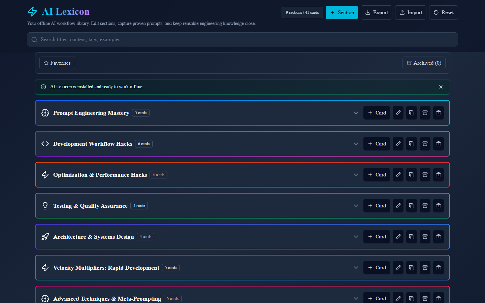
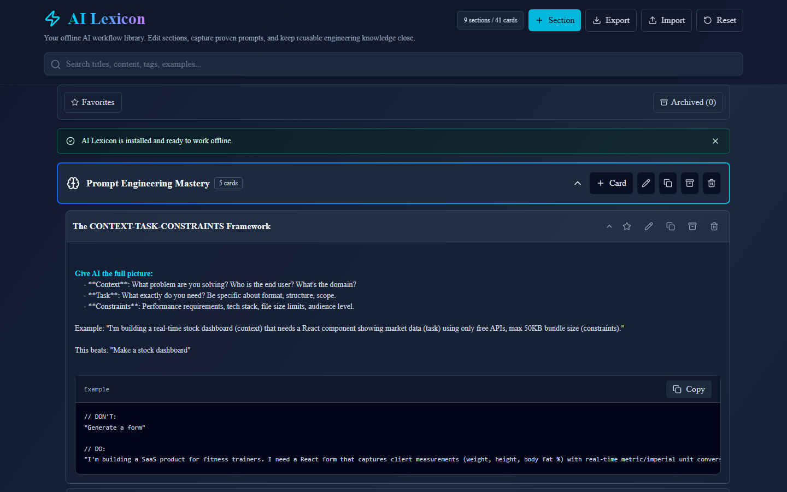
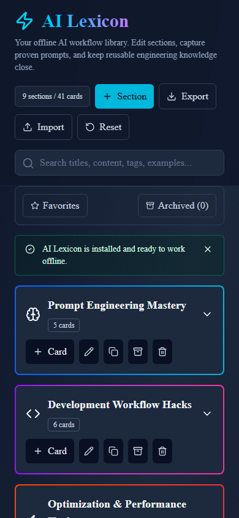

# AI Lexicon

AI Lexicon is an offline-first, installable React app for building a private library of AI-assisted engineering workflows. It starts with a practical guide for prompting, coding, testing, architecture, tooling, and delivery, then lets you edit it into your own trusted lexicon — no account, no server, no tracking.

## Demo

| Desktop | Card expanded | Mobile |
| --- | --- | --- |
|  |  |  |

Want to try it yourself instead of just looking at screenshots? Run `npm install && npm run dev` and open the printed local URL — every feature works fully offline against your own browser storage, so there's nothing to configure or sign up for.

## Features

- Search across section titles, descriptions, card content, tags, notes, and examples.
- Expand and collapse sections and cards for focused reading.
- Create, edit, duplicate, archive, and delete sections.
- Create, edit, duplicate, archive, and delete prompt/workflow cards.
- Add tags and private notes to cards.
- Copy reusable prompt examples to the clipboard.
- Favorite cards and filter by tags (any/all match) or favorites only.
- Archive and restore sections/cards from an Archived drawer.
- Export/import a full JSON backup.
- Fill `{variable}` placeholders in a card's content/example through a template filler, then copy the generated, variable-substituted prompt without touching the saved template.
- Persist changes offline in browser `localStorage`.
- Reset back to the starter guide when needed.
- Install as a desktop or mobile app (PWA) and keep working fully offline, with a banner prompting you to refresh when a new version is available.
- Keyboard- and screen-reader-friendly: labeled controls, focus-trapped/Escape-to-close dialogs, and live-announced status banners (see [Accessibility](#accessibility)).
- 100% local data with no account, server, or tracking of any kind (see [PRIVACY.md](PRIVACY.md)).
- Build as a static frontend with Vite.

## Repository Structure

```text
.
|-- AI-Lexicon.jsx                  # Main React app orchestrator
|-- AI-Lexicon.test.jsx             # Critical-path UI tests (search, favorites, import errors)
|-- docs/screenshots/               # README screenshots
|-- public/icons/                   # PWA app icons (192/512/maskable/apple-touch/favicon)
|-- src/
|   |-- components/                 # Focused UI components under 300 lines
|   |-- constants/                  # App option lists
|   |-- data/starterGuideData.js    # Starter guide content
|   |-- data/starterSections/       # Starter guide sections split by topic
|   |-- hooks/                      # Stateful React hooks (data, actions, filters, template fill, PWA/offline status, dialog a11y, ...)
|   |-- lib/actions/                # Pure data mutation helpers, split by responsibility
|   |-- lib/lexiconActions.js       # Barrel re-export of lib/actions/*
|   |-- lib/lexiconFilters.js       # Pure search/tag/favorite/archive-view helpers
|   |-- lib/lexiconStorage.js       # Local persistence adapter
|   |-- lib/templateVariables.js    # Template `{variable}` extraction/substitution helpers
|   |-- test/setup.js               # Vitest + Testing Library setup (jest-dom matchers)
|   |-- main.jsx                    # React app entrypoint
|   `-- index.css                   # Tailwind CSS import and base styles
|-- index.html                      # Vite HTML entrypoint (manifest link injected at build time)
|-- vite.config.js                  # Vite React + Tailwind + PWA + Vitest configuration
|-- package.json                    # JavaScript scripts and dependencies
|-- requirements.txt                # Python dependency note
|-- pyproject.toml                  # Optional Python project metadata
|-- DEPENDENCIES.md                 # Dependency explanations
|-- PRIVACY.md                      # What's stored, where, and who can see it
|-- QuickStarterGuide.md            # Fast setup path
`-- project-memory-bank/            # Project context for AI-assisted development
```

## Prerequisites

- Node.js `>=20.19.0`
- npm, included with Node.js
- Optional: Python `>=3.12` if you want to run or extend `main.py`

Verify your tools:

```bash
node --version
npm --version
python --version
```

## Installation

From the project root:

```bash
npm install
```

This installs React, Vite, Tailwind CSS, Lucide icons, and the build plugins listed in `package.json`.

## Run Locally

```bash
npm run dev
```

Vite will print a local URL, usually `http://localhost:5173`. Open that URL in a browser.

## Build For Production

```bash
npm run build
```

The production-ready static files are generated in `dist/`.

## Preview The Production Build

```bash
npm run preview
```

This serves the already-built `dist/` output locally so you can verify what will be deployed.

## Testing

```bash
npm run test
```

Runs the full Vitest suite (`npm run test:watch` for watch mode). Coverage includes:

- Pure logic in `src/lib/` — storage load/save/corruption-recovery, backup export/import (including the malformed/wrong-shaped-JSON regression tests), data mutation actions, search/tag/favorite/archive filtering, and template variable extraction/substitution.
- `src/hooks/useLexiconData.test.js` — autosave, corrupted-storage recovery, quota-exceeded save errors, and import success/failure paths, using `@testing-library/react`'s `renderHook`.
- `AI-Lexicon.test.jsx` — critical end-to-end UI behavior rendered with `@testing-library/react`: the starter lexicon renders, search filtering shows/hides results, a favorite toggle persists across a fresh mount (proving the `localStorage` round-trip), and importing an invalid backup file shows an inline error banner without losing existing data.

This is intentionally not full coverage of every component — see [DEPENDENCIES.md](DEPENDENCIES.md) and `project-memory-bank/implementation-status.md` for what's covered versus verified manually.

## Accessibility

AI Lexicon is built to be usable with a keyboard and a screen reader, not just a mouse:

- A "Skip to content" link (visible on keyboard focus) lets you bypass the header and jump straight to the lexicon.
- Every icon-only button (favorite, edit, duplicate, archive, delete, fill template, etc.) has a descriptive `aria-label`, not just a hover tooltip.
- Expand/collapse toggles (sections, cards) expose `aria-expanded`; toggle filters (favorites, tag chips) expose `aria-pressed`.
- All four dialogs (edit section/card, confirm, archived items drawer, template filler) trap focus while open, restore focus to the triggering element on close, and close on <kbd>Escape</kbd>.
- Status banners (save errors, import errors, offline notice, update-available, recovered-data notice) are announced via `role="alert"`/`role="status"` with `aria-live`, so screen reader users hear them without needing to find them visually.
- "Copied!" feedback on copy buttons is in an `aria-live` region so the confirmation is announced, not just shown.

## How The App Works

`AI-Lexicon.jsx` owns app state, filtering, editor flow, confirmations, and persistence calls. Rendering is split into small components under `src/components/`.

- Starter content is aggregated by `src/data/starterGuideData.js` and split by topic in `src/data/starterSections/`.
- Runtime changes are persisted through `src/lib/lexiconStorage.js`.
- Data changes are handled by pure helpers in `src/lib/lexiconActions.js`.
- The storage model uses `schemaVersion`, `appVersion`, timestamps, and `sections`.
- Each section has title, description, icon, accent color, order, archive state, timestamps, and cards.
- Each card has title, content, example code, notes, tags, favorite flag, archive state, copy metadata, template-copy metadata, and timestamps.

## Prompt Templates

Wrap a placeholder in curly braces anywhere in a card's Content or Example field, e.g. `Explain {problem} to {audience} using {framework}.` The card then shows a wand icon; clicking it opens a filler with one input per detected variable, a live preview of the generated text, and a "Copy generated prompt" button. The saved card is never modified by filling a template — only the on-screen preview changes, and each generated copy is tracked separately (`templateCopyCount`/`lastTemplateCopiedAt`) from regular example copies.

## Install & Offline

AI Lexicon is a Progressive Web App (PWA): the production build ships a web app manifest and a service worker that precaches the app shell (HTML, JS, CSS, icons), so the app keeps working with no network connection.

**Install it:**
- **Desktop Chrome/Edge**: open the app, then click the install icon in the address bar (or the browser menu's "Install AI Lexicon..." option).
- **Android Chrome**: open the app, then use the menu's "Add to Home screen" / "Install app" option.
- **iOS Safari**: open the app, tap Share, then "Add to Home Screen."

**Offline behavior:**
- Once you've loaded the app at least once (dev server excluded — the service worker only runs in the production build/preview or a deployed site), it continues to load and function with no network connection.
- A banner appears whenever the browser reports you're offline, confirming edits still save normally to this browser's local storage.
- All data (sections, cards, tags, favorites, archive, template-copy stats) already lives in `localStorage`, so offline editing was always safe — the service worker adds offline *app shell loading*, i.e. the app itself now opens without a network round-trip.

**Updates:**
- When you deploy a new build, the service worker detects it in the background. A banner appears with a "Refresh" action; clicking it activates the new version. Until you click it, you keep using the version you already have loaded — nothing is force-reloaded out from under you.

## Privacy & Data Storage

Everything you create lives only in this browser's `localStorage` — there is no account, no backend, and no telemetry. See [PRIVACY.md](PRIVACY.md) for the full breakdown of what's stored, where it lives, and how to back it up or clear it.

## Editing Content

Use the app UI for normal editing:

- Click `Section` to create a new section.
- Click `Card` inside a section to add a new card.
- Use pencil buttons to edit existing sections or cards.
- Use copy buttons to duplicate useful structures.
- Use archive when you want to hide something without destroying the record.
- Use delete only when the item can be permanently removed from local storage.

Starter content can still be updated by editing the relevant file in `src/data/starterSections/`, but existing browser data will continue using the user’s locally saved version until reset.

## Dependency Notes

Read `DEPENDENCIES.md` for a plain-English explanation of each dependency and why it exists.

There are no Python packages to install. `requirements.txt` intentionally documents that the runnable app is frontend-only today.

## Deployment

This is a static frontend after build. You can deploy the `dist/` folder to static hosts such as Netlify, Vercel, Cloudflare Pages, GitHub Pages, or an internal static web server.

Typical deployment command:

```bash
npm run build
```

Upload or serve the generated `dist/` directory.

## Troubleshooting

### `npm install` fails

Check Node.js first. Vite requires a modern Node.js version, and this project declares `>=20.19.0`.

### The page renders without styling

Confirm `src/index.css` contains `@import "tailwindcss";` and `vite.config.js` includes `@tailwindcss/vite`.

### Icons do not appear

Run `npm install` again and confirm `lucide-react` is listed in `package.json`.

### My edits disappeared

The current persistence layer uses browser `localStorage`. Edits are tied to the browser/profile/domain where you made them. Use Export to download a JSON backup regularly, and Import to restore it in another browser/profile.

### The install icon doesn't appear in my browser

PWA install prompts require the production build (`npm run build` + `npm run preview`, or a real deployment) served over `https://` or `localhost` — the plain `npm run dev` server does not register a service worker. Also confirm your browser supports PWA installation (most current Chromium-based browsers do; Firefox desktop does not).

### Copy buttons do not work

Clipboard access is a browser feature and may require a secure context in some environments. It works on localhost in modern browsers.

### `python main.py` only prints a greeting

That is expected. The Python file is a placeholder and not part of the frontend runtime.

## FAQ

### Is this a Python app or a React app?

It is a React app. Python metadata exists, but the user-facing application runs through Vite.

### Where do I start as a new engineer?

Read `QuickStarterGuide.md`, run `npm install`, then run `npm run dev`.

### What file should I edit to change the app behavior?

Start with `AI-Lexicon.jsx` for app flow, `src/components/` for UI pieces, `src/lib/lexiconActions.js` for data mutations, and `src/lib/lexiconStorage.js` for persistence.

### Do I need a backend?

No. The current app is fully static and runs in the browser.

### Do I need environment variables?

No environment variables are required.

### How do I know my changes did not break the app?

Run `npm run test`, then `npm run build`, then `npm run preview`. Open the preview URL and check search, expand/collapse, editing, archive/delete confirmations, reset, and copy buttons. To check PWA/offline behavior specifically, open the preview URL, then use your browser's DevTools to go offline and reload — the app shell should still load.

### Is this safe to point at real/sensitive prompts and notes?

Yes, in the sense that nothing leaves your browser (see [PRIVACY.md](PRIVACY.md)) — but "safe" here means "private," not "backed up." There is no cloud copy, so treat Export/Import as your backup strategy, the same as you would for any local-only document.
